# C-plus-plus-projects

This repository contains six beginner-friendly C++ projects:

1. **Calculator** – Perform basic arithmetic operations.  
2. **To-Do List** – Add, remove, and display tasks.  
3. **Notes App** – Read, write, and edit text files.  
4. **Quiz Application** – Read questions from a file and check answers.  
5. **Student Management System** – Store and manage student records.
6. **Rock, Paper, Scissors** – Play against the computer.  


---

## 📌 Projects Overview

### **1️⃣ Calculator**
A simple arithmetic calculator that allows users to perform operations like:
- Addition (+)
- Subtraction (-)
- Multiplication (*)
- Division (/)

📂 **File:** `calculator.cpp`  
🛠 **Features:**  
✅ Supports integer & floating-point numbers  
✅ Error handling for division by zero  

---

### **2️⃣ To-Do List**
A command-line task manager that allows users to:
- Add tasks  
- View task list  
- Remove completed tasks  

📂 **File:** `todo list.cpp`  
🛠 **Features:**  
✅ Simple text-based interface  
✅ Data persistence using a file  

---

### **3️⃣ Notes App **
A basic text editor that allows users to:
- Write notes to a file  
- Read and display notes  
- Clear existing notes  

📂 **File:** `notes app.cpp`  
🛠 **Features:**  
✅ File handling using `ifstream` and `ofstream`  
✅ Append or overwrite text  

---

### **4️⃣ Quiz Application**
A text-based quiz game that:
- Reads questions from a file  
- Prompts the user for answers  
- Displays the final score  

📂 **File:** `quiz.cpp`  
📂 **Questions File:** `questions.txt`  
🛠 **Features:**  
✅ File-based question storage  
✅ Auto-evaluates answers  

---

### **5️⃣ Student Management System**
A file-based system to store student details:
- Add new students  
- View student records  
- Delete student data  

📂 **File:** `student management system.cpp`  
🛠 **Features:**  
✅ Uses structured file handling  
✅ Supports student name, roll number, and marks  

---

### **6️⃣ Rock, Paper, Scissors**
A classic **Rock, Paper, Scissors** game where you play against the computer!  
- The user selects Rock (1), Paper (2), or Scissors (3).  
- The computer randomly picks one of the three.  
- The game decides the winner based on the rules.  

📂 **File:** `rock_paper_scissors.cpp`  
🛠 **Features:**  
✅ Randomized computer choice  
✅ Instant result display  
✅ User-friendly interface  

---

## 📸 Screenshots

### 🧮 Calculator
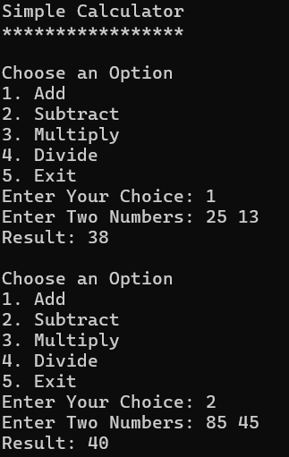 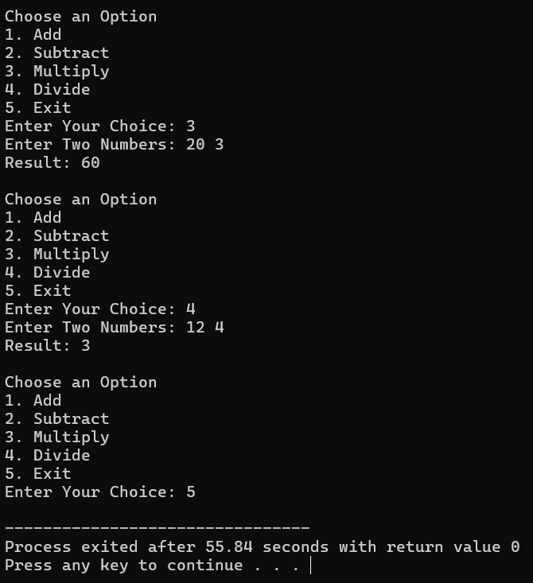

### 📋 To-Do List
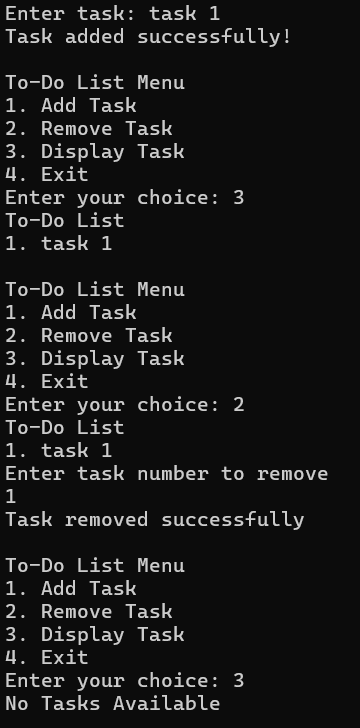

### 📝 Notes App
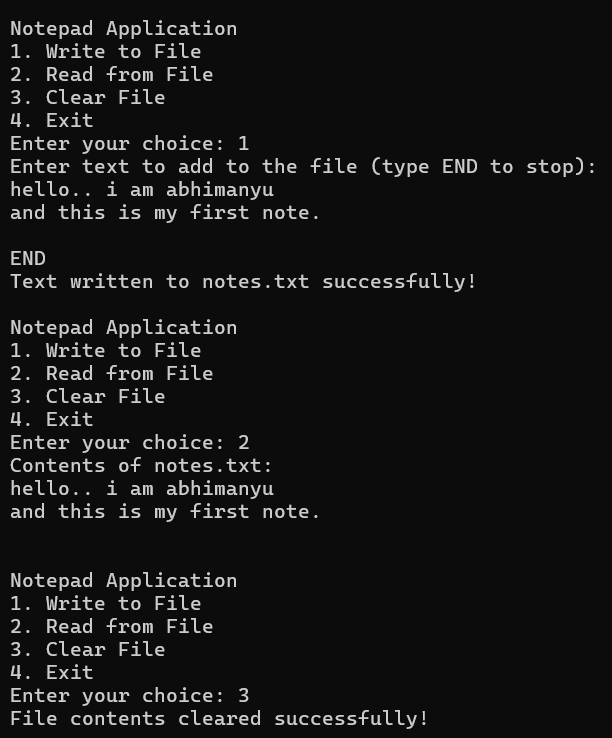

### ❓ Quiz Application
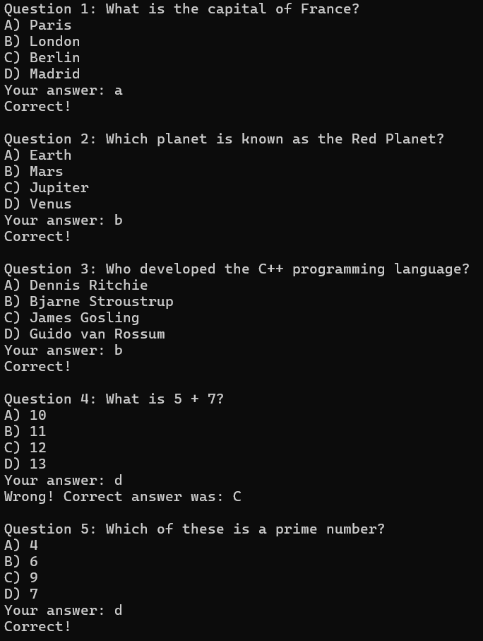 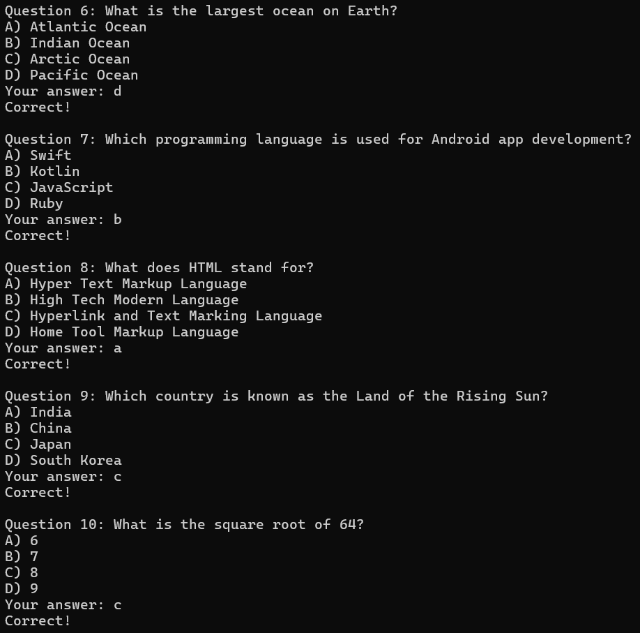 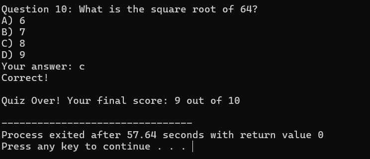

### 🎓 Student Management System
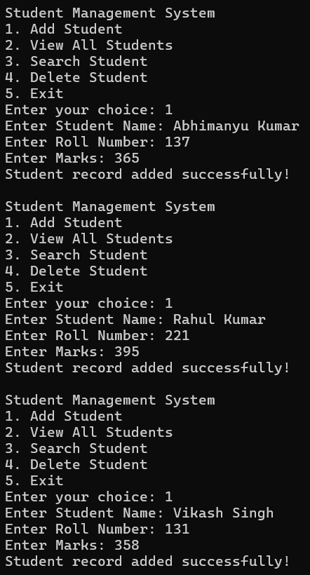 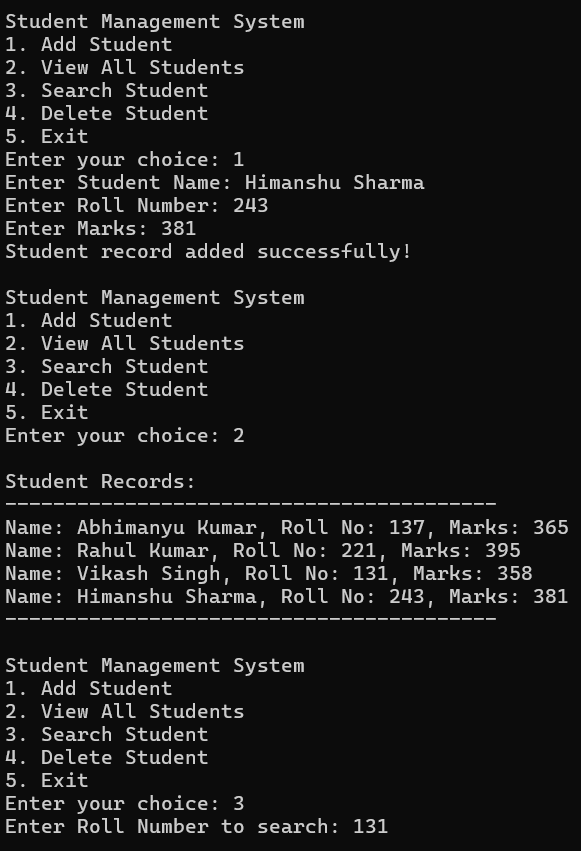 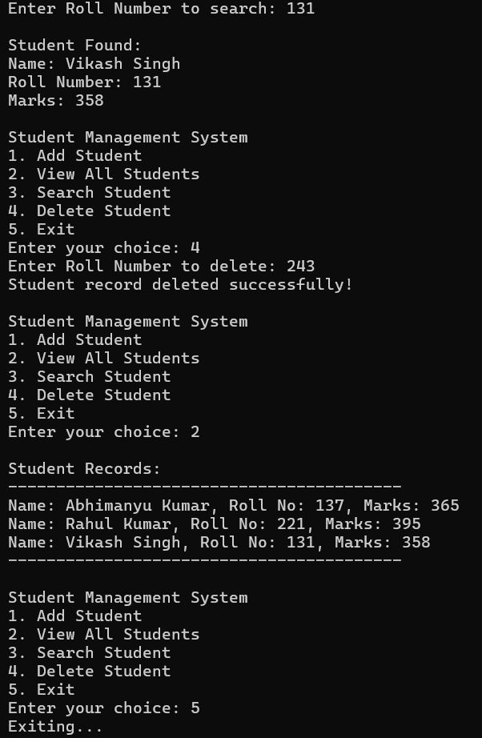

### ✊🖐✌ Rock, Paper, Scissors
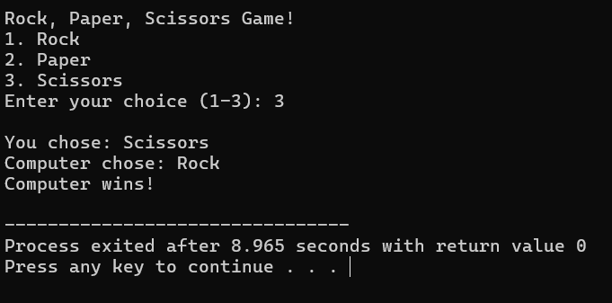


---

## 🛠 Installation & Usage
1. Clone this repository:  
   ```sh
   git clone https://github.com/yourusername/cpp-mini-projects.git

2. Compile any project using g++ (Example for Calculator):
   ```sh
   g++ calculator.cpp -o calculator
   ./calculator
   
3. Follow the on-screen instructions for each program.

